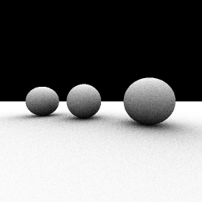

aobench - SML
===============================



what is this
-------------------------------

Ported [aobench](http://code.google.com/p/aobench/) program to StandardML.

> aoench is a small ambient occlusion renderer for benchmarking realworld floating point performance in various languages. 

how to use
-------------------------------

Only run meta-aobench.sh :)
this script compile and run aobench program automatically with timing measurement.

```sh
$ ./meta-aobench.sh
```

If the benchmark succeed, you will see the result of programs as _aobench-xxx.ppm_.
ppm is a very simple picture format. You can convert ppm to popular format with converter such as pnmtopng.

supported compiler
-------------------------------

- gcc (performance criterion)
- [SML/NJ][1]
- [MLton][2]
- [SML#][3]

license
-------------------------------

this is distributed unser the [New BSD](http://opensource.org/licenses/BSD-3-Clause) license, except code from smlnj-lib.


[1]: http://www.smlnj.org/
[2]: http://mlton.org/
[3]: http://www.pllab.riec.tohoku.ac.jp/smlsharp/


